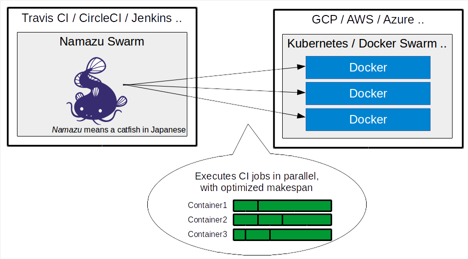

# Namazu Swarm: CI Job Parallelizer built on Docker and Kubernetes

[](https://gitter.im/osrg/namazu?utm_source=badge&utm_medium=badge&utm_campaign=pr-badge&utm_content=badge)
[](https://travis-ci.org/osrg/namazu-swarm)

Namazu Swarm executes multiple CI jobs in parallel across a Docker cluster



Namazu Swarm is a part of [Namazu](https://github.com/osrg/namazu), a programmable fuzzy scheduler for testing distributed systems.
[Namazu (鯰) means a catfish :fish: in Japanese](https://en.wiktionary.org/wiki/%E9%AF%B0).

Blog: [http://osrg.github.io/namazu/](http://osrg.github.io/namazu/)

Twitter: [@NamazuFuzzTest](https://twitter.com/NamazuFuzzTest)

## Motivation

- Faster test execution
- Reproduction of flaky test by repeating the test many times simultaneously
- `git bisect`

Many code were copy-pasted from [our contribution to accelerate CI of Docker/Moby x20 faster (on 10 nodes)](https://github.com/docker/docker/tree/v17.05.0-ce/hack/integration-cli-on-swarm).

## Talks

- [OSS/ContainerCon Japan (May 31-June 2, 2017, Tokyo)](http://sched.co/AOmo) [[slide](http://events.linuxfoundation.jp/sites/events/files/slides/Parallelizing%20CI%20Using%20Docker%20Swarm-mode.pdf)]

## Quick Start
### Installation

    $ ./make.bash
    $ cp ./bin/* /usr/local/bin/

### Execute on Docker Swarm (single-host)

Initialize the Swarm cluster:

    $ docker swarm init

Build the example image:

    $ docker build -t dummy ./example/dummy

Execute in 10 concurrent containers:

    $ nmzswarm -source dummy -replicas 10


### Execute on Docker Swarm (multi-host)

Set `-push` and `target` explicitly, so that `nmzswarm` can push the image to the shared registry.

    $ nmzswarm -source dummy -replicas 10 -target your-docker-registry.example.com/foo/bar:baz

## Spec

Please refer to [`example/dummy`](./example/dummy) for an example.

A Docker/OCI image used for Namazu Swarm is supported to have the following image labels:

- `net.osrg.namazu-swarm.v0.master.script`: shell command that writes the line-separated list of workload identifiers to the stdout.
- `net.osrg.namazu-swarm.v0.worker.script`: shell command that executes the workload of which identifiers are passed via the stdin.


e.g.
```dockerfile
FROM busybox
# tests.txt contains line-separated list of raw shell commands
ADD tests.txt /
LABEL net.osrg.namazu-swarm.v0.master.script="cat /tests.txt" \
      net.osrg.namazu-swarm.v0.worker.script="sh -e -x"
````

Workload identifiers can be raw shell command strings, but not generally intended to be so.

## Implemented and planned features

**Orchestrator**:

 - [ ] Kubernetes (was default in [v0.0.1](https://github.com/osrg/namazu-swarm/tree/v0.0.1), removed atm)
 - [X] Docker Swarm-mode (Docker 1.13 or later)

**CI**:

 - [X] Any! (that supports storing credentials for accessing the orchestrator. Example: [TravisCI](https://docs.travis-ci.com/user/encryption-keys/))

**Target program**:

 - [X] Any!

**Job progress UI**:

 - [X] Text
 - [ ] curses
 - [ ] Static HTML

**Report**:

 - [X] stdio
 - [ ] Static HTML

**Scheduling**

 - [X] Chunking & shuffling techniques presented at [the OSS/ContainerCon talk](http://sched.co/AOmo)
 - [ ] Makespan optimization using the past job execution history on a DB


## How to Contribute
We welcome your contribution to Namazu Swarm.
Please feel free to send your pull requests on github!


## Copyright
Copyright (C) 2017 [Nippon Telegraph and Telephone Corporation](http://www.ntt.co.jp/index_e.html).

Released under [Apache License 2.0](LICENSE.txt).

- - -

## Information about the previous release [v0.0.1](https://github.com/osrg/namazu-swarm/tree/v0.0.1) (based on Kubernetes)

## Experimental Result

Software|Testing Method|#Node|#CPU per Node|RAM per Node|Time|Additional Info
---|---|---|---|---|---|---
etcd|Standalone|1|4|15GB|4 min|[#3](https://github.com/osrg/namazu-swarm/pull/3)
etcd|**Namazu Swarm (k8s)**|**5**|4|15GB|**1 min**|[#3](https://github.com/osrg/namazu-swarm/pull/3)
ZooKeeper|Standalone|1|4|15GB|60 min|[#6](https://github.com/osrg/namazu-swarm/pull/6)
ZooKeeper|**Namazu Swarm (k8s)**|**5**|4|15GB|**10 min**|[#6](https://github.com/osrg/namazu-swarm/pull/6)

Note that the first iteration can take a few extra minutes due to pushing the Docker image to the registry.


